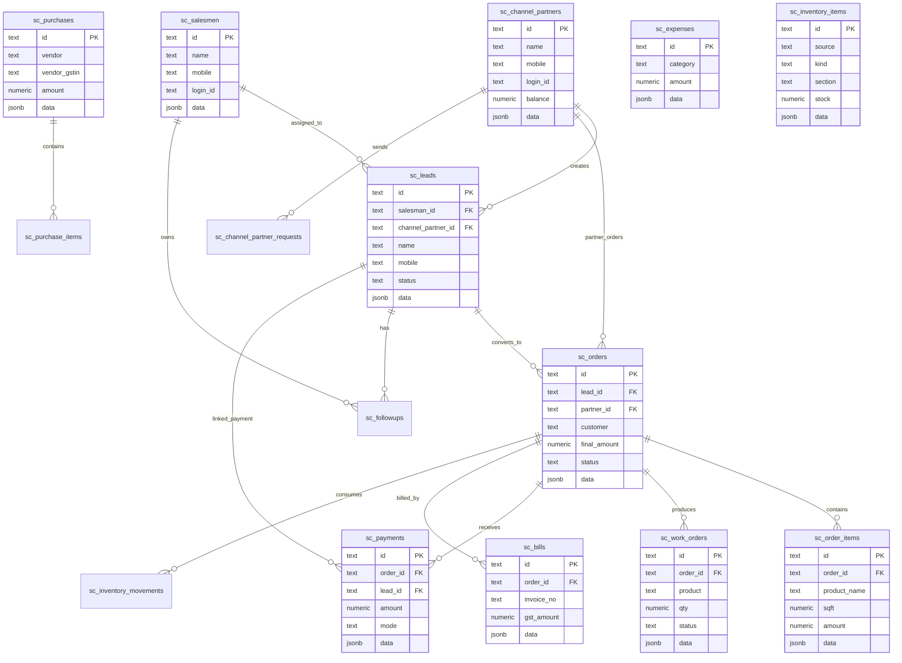

# Smart Covering ERP app_state Relational Migration

This migration keeps the existing `app_state` table untouched and creates a new relational layer for the ERP modules.

## New Tables

- `sc_salesmen`
- `sc_channel_partners`
- `sc_channel_partner_requests`
- `sc_leads`
- `sc_orders`
- `sc_order_items`
- `sc_work_orders`
- `sc_followups`
- `sc_payments`
- `sc_bills`
- `sc_purchases`
- `sc_purchase_items`
- `sc_expenses`
- `sc_inventory_items`
- `sc_inventory_movements`
- `sc_reassignment_logs`
- `sc_app_audit_logs`

Each table stores important searchable/reporting columns separately and also keeps the original JSON row in a `data jsonb` column so no existing field is lost during migration.

## Files Added

- `server/db/app_state_relational_schema.sql`
- `server/db/migrate_app_state_to_relational.sql`
- `server/routes/relationalState.js`

## How To Run In Neon

1. Take a Neon backup/snapshot first.
2. Run `server/db/app_state_relational_schema.sql` in the Neon SQL editor.
3. Run `server/db/migrate_app_state_to_relational.sql`.
4. Check table row counts against `app_state`.
5. Verify `/api/relational-state` in staging.
6. Only after verification, switch the frontend from `/api/app-state` to `/api/relational-state`.

Do not delete or modify `app_state` until all reports, login flows, billing, purchases, inventory, production, and payments are verified.

## Verification Queries

```sql
select key, jsonb_array_length(value) as app_state_rows
from app_state
where jsonb_typeof(value) = 'array'
order by key;

select 'leads' as table_name, count(*) from sc_leads
union all select 'orders', count(*) from sc_orders
union all select 'salesmen', count(*) from sc_salesmen
union all select 'channel_partners', count(*) from sc_channel_partners
union all select 'payments', count(*) from sc_payments
union all select 'expenses', count(*) from sc_expenses
union all select 'bills', count(*) from sc_bills
union all select 'purchases', count(*) from sc_purchases
union all select 'work_orders', count(*) from sc_work_orders
union all select 'followups', count(*) from sc_followups;
```

## ER Diagram



## Current API Status

`/api/app-state` remains unchanged and still reads/writes `app_state`.

`/api/relational-state` is added for verification. It exposes the same state-like shape while writing each entity into its own table.

When verified, the frontend can switch:

```js
fetch("/api/relational-state")
```

instead of:

```js
fetch("/api/app-state")
```
